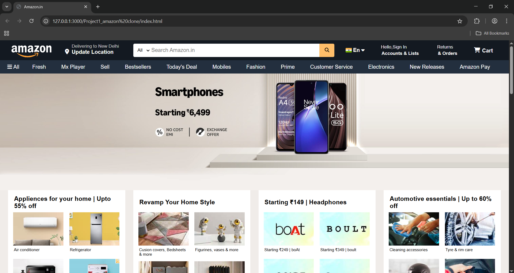
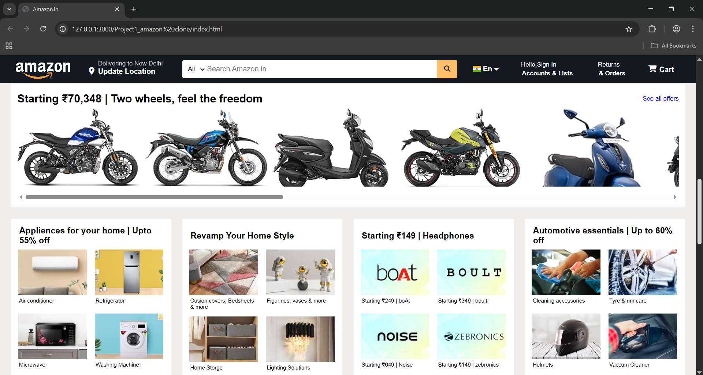
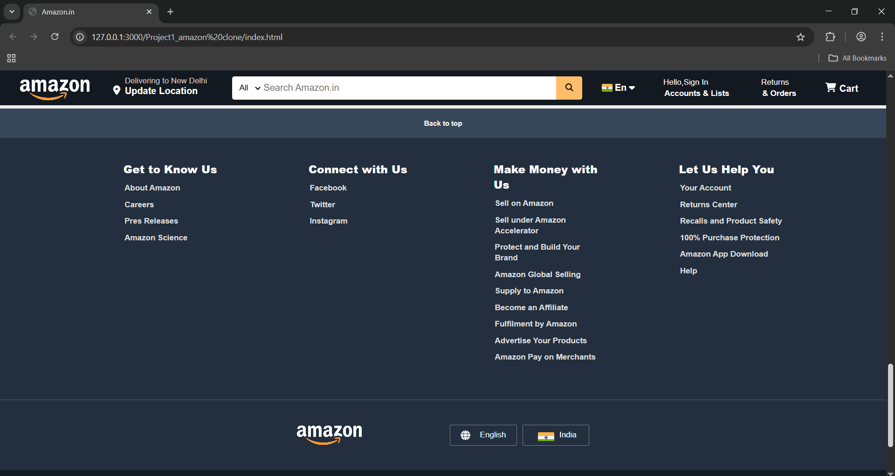

# Amazon Home Page Clone

A UI clone of the "Amazon India homepage" built using **pure HTML and CSS**.  

---

## 🔗 Live Demo

 [View Live on vercel](https://amazon-homepage-clone-mu.vercel.app/)

---

##  Project Preview

###  Home Page

###  Product Slider & Product Boxes

###  Footer Section

---

## Purpose

> This project was built to sharpen my **HTML and CSS skills**. It really helped me to understand how real-world websites like Amazon are structured and styled.

---

## Key Features

-  Fully structured layout similar to [Amazon.in](https://www.amazon.in)
-  Sticky navigation bar with:
  - Logo, search bar, language select, sign-in, cart etc
-  **Horizontally scrollable** product rows (bikes, gadgets, etc.)
-  Footer & Small Navbar with real working Amazon links 

---

##  Limitations

-  One **static hero/banner** image not changable
-  No mobile responsiveness (works only on desktop)
-  No JavaScript or interactivity
-  Internal links (product cards, categories) are static and non-clickable

---

##  Tech Stack

- **HTML** – For Structure of Website
- **CSS** – For styling
- **Font Awesome** – For icons (cart, flag etc.)
- No frameworks or libraries used

---

##  Time Spent

 Built in just **1 day**  
 Horizontal scrolling & Product Boxes section was the most challenging but rewarding part!

---

##  What I Learned

- How to plan and build a webpage from scratch
- Flexbox layout and scrollable sections
- Real-world styling practices and debugging
- Using developer tools and external help (like GPT and docs)

---

##  Future Plans

-  Add **JavaScript** to create image sliders and interactive features
-  Possibly add backend functionality in the future

---

##  Author

**Pratham Gambhir**  
📎 [GitHub Profile](https://github.com/prathamgambhir)  
  Feel free to connect and give feedback!

---

## ⚠️ Disclaimer

This project is for **educational purposes only**.  
All Amazon assets used (logos, images) are property of **Amazon Inc.**

